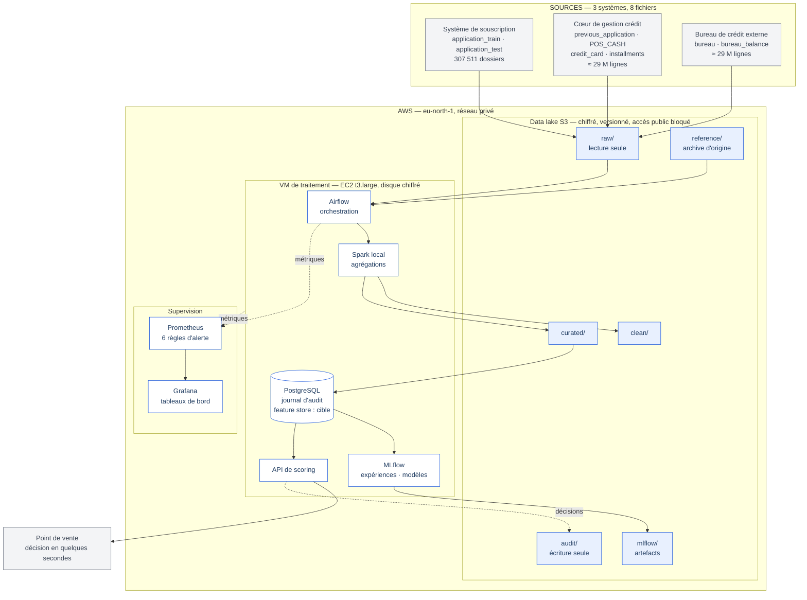
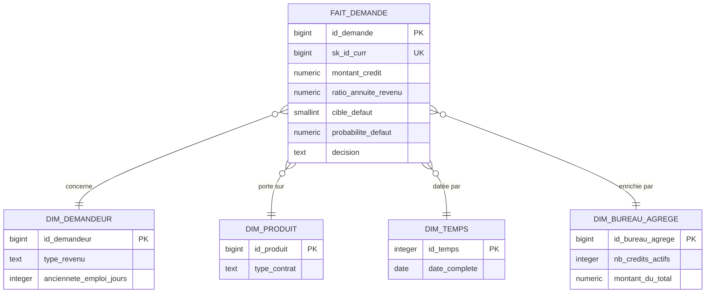

# Architecture technique — CrediScore

Dernière vérification sur l'infrastructure réelle : 24/08/2026.

Ce document décrit ce qui **tourne**, pas ce qui est prévu. Chaque élément du
diagramme correspond à une ressource présente dans `terraform state list` ou à
un conteneur visible dans `docker compose ps`.

---

## 1. Vue d'ensemble



---

## 2. Les couches, et pourquoi elles sont séparées

| Couche | Composant | Rôle | Pourquoi séparé |
|---|---|---|---|
| **Stockage** | S3, **6 zones** | Brutes, référence, nettoyées, prêtes, artefacts, audit | Chaque zone a ses propres droits — voir §2 bis. `raw/` est en lecture seule même pour la VM ; `audit/` en écriture seule pour l'API |
| **Orchestration** | Airflow | Enchaîne ingestion → agrégation → publication | Reprise sur erreur et alertes, sans intervention manuelle |
| **Traitement** | Spark en mode local | Agrège 58 M de lignes en variables par dossier | Même code qu'un cluster ; seul le maître change à l'échelle cible |
| **Service de variables** | Parquet sur S3 aujourd'hui, PostgreSQL en cible | Magasin de variables + entrepôt en étoile | Définitions identiques à l'entraînement et au scoring — élimine le *train/serving skew*. Le schéma `feature_store` est créé, pas encore alimenté (voir §9) |
| **Suivi de modèles** | MLflow | Expériences, métriques, registre | Rend le réentraînement reproductible |
| **Supervision** | Prometheus + Grafana | Métriques, seuils, alertes | Détecter une panne avant l'utilisateur |

---

## 2 bis. Les six zones du data lake

Une zone n'existe, sur S3, que par les droits qu'on lui accorde — le service n'a
pas de dossiers. Les zones sont donc déclarées **une seule fois**, dans
`infra/datalake.tf`, et la politique IAM en est **dérivée** : il est impossible
d'accorder un droit sur une zone non déclarée, ou de déclarer une zone que
personne ne peut atteindre.

| Zone | Contenu | VM de traitement | API de scoring |
|---|---|---|---|
| `raw/` | Exports bruts des systèmes sources **et dictionnaire des colonnes** | lecture | — |
| `reference/` | **Archive d'origine** — preuve d'intégrité | lecture | — |
| `clean/` | Données typées, attributs sensibles déviés | lecture-écriture | — |
| `curated/` | Variables agrégées au grain du dossier | lecture-écriture | lecture |
| `mlflow/` | Modèles, graphiques SHAP, rapports d'équité | lecture-écriture | — |
| `audit/` | Journal des décisions de scoring | — | **écriture seule** |

**Deux lignes de ce tableau méritent d'être lues attentivement.**

`raw/` est en lecture seule **même pour la machine qui traite les données**. Un
bug du pipeline ne peut donc pas corrompre la donnée source. Ce n'est pas une
convention de développement, c'est une politique IAM — et elle se démontre :
un `aws s3 cp` vers `raw/` depuis la VM renvoie `AccessDenied`.

`audit/` est en **écriture seule** : ni lecture, ni suppression. L'API peut y
déposer chaque décision de scoring, mais ne peut ni la relire ni l'effacer.
C'est précisément ce qui permet à ce journal de faire foi lorsqu'un demandeur
conteste un refus — celui qui écrit la preuve ne peut pas la réécrire
(politique P-7, AI Act art. 12).

`reference/` conserve l'**archive d'origine**, telle qu'elle a été reçue et
jamais décompressée. Ce n'est pas une sauvegarde de confort : son empreinte
permet d'établir que les fichiers de `raw/` n'ont pas été altérés entre la
réception et le traitement. C'est la réponse à une question qu'un auditeur pose
naturellement lorsque la donnée source commande des décisions de crédit — *comment
savez-vous que ce que vous traitez est bien ce que vous avez reçu ?*

---

## 3. Modèle de données — schéma en étoile



**Le grain de la table de faits est la demande de crédit** : une ligne, une
décision d'octroi possible. Les quatre dimensions répondent aux questions du
reporting risques — *qui*, *quoi*, *quand*, *avec quelle exposition externe*.

`dim_bureau_agrege` mérite un mot : c'est une dimension **précalculée**. Agréger
29 millions de lignes de bureau à chaque demande serait incompatible avec une
réponse en quelques secondes au point de vente. Le pipeline la rafraîchit
quotidiennement ; le scoring se contente de la lire.

---

## 4. Sécurité — quatre mesures, et la preuve de chacune

| Mesure | Mise en œuvre | Comment le vérifier |
|---|---|---|
| **Chiffrement au repos** | S3 chiffré côté serveur ; volume EC2 `encrypted = true` | Console AWS, ou `terraform state show aws_s3_bucket_server_side_encryption_configuration.datalake` |
| **Chiffrement en transit** | TLS pour S3 et les API AWS ; SSH pour l'accès à la VM | — |
| **Moindre privilège** | Deux rôles IAM distincts : la VM et l'API de scoring | Depuis la VM : lecture `raw/` autorisée, écriture `curated/` autorisée, écriture `raw/` **refusée** |
| **Aucun secret dans le code** | Rôle IAM d'instance ; `.env` hors dépôt ; clé de déploiement en lecture seule | `git log -S` sur l'historique : aucune clé, aucun jeton |

**La séparation des schémas PostgreSQL est elle-même une mesure.** Les attributs
sensibles (genre, âge) vivent dans `audit_equite`, jamais dans `feature_store`,
et une contrainte `CHECK` fait refuser par la base toute variable marquée
sensible au registre des variables servies. La non-discrimination devient une
propriété du modèle physique, opposable en audit.

---

## 5. Les 3V

| Dimension | Réalité mesurée |
|---|---|
| **Volume** | ≈ 58 M de lignes consolidées, dont 27,3 M pour les seuls soldes mensuels du bureau |
| **Vélocité** | Décision synchrone en quelques secondes au point de vente ; rafraîchissement batch quotidien des historiques |
| **Variété** | 8 fichiers hétérogènes, 3 systèmes sources internes et externe, 3 granularités — dossier, crédit, mois |

---

## 6. Supervision

Six règles d'alerte, chacune avec un seuil justifié et l'action à mener. Toutes
les expressions ont été **vérifiées contre les métriques réellement exposées** —
deux d'entre elles interrogeaient au départ des séries inexistantes et ne
pouvaient jamais se déclencher (décision D-110).

| Alerte | Seuil | Domaine |
|---|---|---|
| `DisqueBientotPlein` | < 15 % libres pendant 5 min | infrastructure |
| `MemoireSaturee` | > 90 % pendant 10 min | infrastructure |
| `ConteneurArrete` | < 9 conteneurs pendant 3 min | infrastructure |
| `OrdonnanceurArrete` | aucun battement de cœur Airflow pendant 5 min | pipeline |
| `DagIllisible` | ≥ 1 erreur d'import de DAG | pipeline |
| `TacheAirflowEnEchec` | ≥ 1 échec sur 15 min | pipeline |

Le tableau de bord `CrediScore — Infrastructure` est **provisionné par fichier**,
pas configuré à la main : une réinstallation le retrouve à l'identique. Ses
seuils de couleur reproduisent exactement ceux des règles — ce qui vire au rouge
à l'écran est ce qui déclenche une alerte.

> **Limite assumée à ce stade :** les alertes sont évaluées et visibles, mais
> pas encore *routées* vers un canal (courriel ou Slack). Le point reste ouvert.

---

## 7. Dimensionnement : démonstrateur et cible

L'architecture décrite dans le dossier de projet est celle d'un établissement
réel. Le démonstrateur en exécute les **mêmes briques logicielles**, à échelle
réduite, sur une seule machine.

| Brique | Démonstrateur | Cible | Ce qui change |
|---|---|---|---|
| Traitement | Spark en mode local | Cluster 3 nœuds | l'URL du maître |
| Feature store | **Parquet sur S3** (`curated/socle_complet`) | PostgreSQL managé | le support, pas la définition — les schémas PostgreSQL existent mais ne sont pas encore alimentés |
| Inférence | **conteneur Docker Compose** (k3s coupé le 02/09, voir `k8s/README.md`) | Kubernetes managé, 3 pods | l'orchestrateur de conteneurs |
| Entraînement | Conteneur à la demande | Cluster éphémère 16 vCPU | une variable Terraform |

Ce n'est pas une simplification de confort mais un **arbitrage coût/bénéfice** :
le référentiel demande une infrastructure déployée, sécurisée, surveillée et
documentée — pas un nombre de nœuds. Le code Terraform reste paramétré, et le
passage à l'échelle cible est un changement de variables, non une réécriture.

---

## 8. Reproductibilité

L'ensemble se reconstruit à partir du seul dépôt :

```bash
cd infra
terraform apply                              # réseau, VM, rôles IAM
ssh ec2-user@$(terraform output -raw ip_publique_vm)
cd /opt/crediscore/depot/docker
cp .env.example .env && ${EDITOR:-nano} .env
docker compose up -d --build                 # les 9 services
psql -f ../pipelines/sql/01_schemas.sql      # les 9 tables
```

Aucune étape manuelle en console AWS. C'est ce qui permet d'affirmer que
l'infrastructure est *dans le code*, et non dans la mémoire de celui qui l'a
montée.
