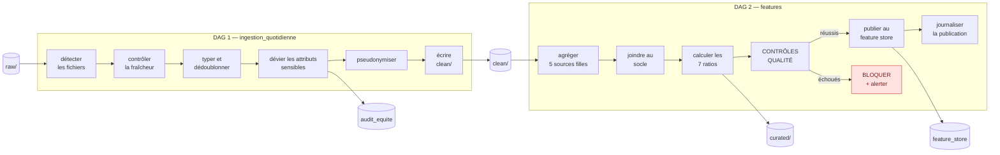

# Conception du pipeline de données

**Bloc 3 — Pipelines de données pour l'IA**
Rédigé le 25/08/2026 · met en œuvre `crediscore-ml/docs/plan_features.md`
et `schema_jointures.md`, dont toutes les valeurs sont **mesurées**.

Ce document décrit ce que le pipeline doit faire, dans quel ordre, et comment on
vérifie qu'il l'a bien fait. Il précède le code volontairement : un pipeline
écrit d'abord et spécifié ensuite ne peut pas être audité.

---

## 1. Le contrat de sortie

Le pipeline a **un seul livrable** : une table de variables prêtes à l'emploi,
au grain du dossier, identique à l'entraînement et au scoring.

| | |
|---|---|
| **Table** | `feature_store.variables_dossier` |
| **Grain** | une ligne par `SK_ID_CURR` — jamais deux |
| **Volume** | 307 511 dossiers annotés + 48 744 à scorer |
| **Colonnes** | ≈ 230 variables (voir `plan_features.md` §7) |
| **Fraîcheur** | rafraîchi quotidiennement |
| **Registre** | chaque colonne déclarée dans `feature_store.registre_variables` |

**Ce qui n'est pas dans le contrat**, et doit être refusé : toute variable
sensible ou dérivée (règle F2), toute variable non calculable dans le budget de
latence (F3), toute variable inexplicable à un client (F4).

---

## 2. Les cinq règles qui commandent chaque décision technique

Reprises de `plan_features.md` §1 — elles ne sont pas négociables.

| | Règle | Conséquence sur le pipeline |
|---|---|---|
| **F1** | Rien qui ne soit connu au moment de la demande | Un contrôle rejette toute colonne temporelle positive |
| **F2** | Aucune variable sensible, ni dérivée | Les attributs protégés sont **déviés** vers `audit_equite` dès l'ingestion |
| **F3** | Calculable dans le budget de latence | Tous les agrégats sont précalculés, jamais à la volée |
| **F4** | Explicable à un client | Chaque variable porte une description au registre |
| **F5** | **Une absence n'est pas un zéro** | Aucune imputation par 0 ; le `NULL` est conservé et un indicateur de présence est produit |

> **F5 mérite un mot en soutenance.** Un dossier sans historique au bureau de
> crédit n'a pas « zéro dette » : il n'a *pas d'information*. Remplir par zéro
> reviendrait à le déclarer bon payeur. LightGBM traite nativement les valeurs
> manquantes — on lui laisse cette information plutôt que de la détruire.

---

## 3. Vue d'ensemble : deux DAGs



**Pourquoi deux DAGs et non un seul.** L'ingestion dépend de l'arrivée des
fichiers, le calcul des variables dépend du code de feature engineering. Les deux
ne changent pas au même rythme et ne se rejouent pas pour les mêmes raisons :
corriger une agrégation ne doit pas obliger à réingérer 2,5 Gio.

---

## 4. DAG 1 — `ingestion_quotidienne`

**Planification :** quotidienne. **Sources :** `raw/` (8 fichiers).
**Sortie :** `clean/` en Parquet, plus `audit_equite.attributs_sensibles`.

### 4.1 Les tâches

| # | Tâche | Ce qu'elle fait | Échec = |
|---|---|---|---|
| 1 | `detecter_fichiers` | Liste les objets de `raw/`, vérifie que les 8 sont présents | **bloque** |
| 2 | `controler_fraicheur` | Le flux bureau doit dater de moins de 48 h | **bloque** |
| 3 | `typer_et_dedoublonner` | Types explicites, doublons de clé primaire supprimés | **bloque** |
| 4 | `neutraliser_sentinelles` | `DAYS_EMPLOYED = 365243` → `NULL` | **bloque** |
| 5 | `devier_attributs_sensibles` | Extrait genre et âge vers `audit_equite`, les retire du flux principal | **bloque** |
| 6 | `pseudonymiser` | Remplace `SK_ID_CURR` par un pseudonyme dans les journaux | avertit |
| 7 | `rejeter_orphelins` | Écarte les enfants sans parent, journalise le volume | avertit |
| 8 | `ecrire_clean` | Écrit en Parquet partitionné dans `clean/` | **bloque** |

### 4.2 La tâche 5 est la plus importante du bloc

C'est elle qui rend vraie la politique P-4. Trois attributs quittent le flux
principal **avant** tout calcul de variable :

| Colonne source | Destination | Devient |
|---|---|---|
| `CODE_GENDER` | `audit_equite.attributs_sensibles.genre` | inaccessible au feature engineering |
| `DAYS_BIRTH` | `audit_equite.attributs_sensibles.age_annees` | idem, converti en années |
| `NAME_FAMILY_STATUS` | `audit_equite.attributs_sensibles` | idem |

Après cette tâche, `clean/` **ne contient plus** ces colonnes. Le contrôle C-1
n'a donc plus rien à interdire : la variable n'existe simplement plus dans le
périmètre du modèle. C'est la différence entre interdire et rendre impossible.

### 4.3 Les orphelins, chiffrés

`schema_jointures.md` les a mesurés. Ils sont écartés et **journalisés**, jamais
silencieusement ignorés :

| Relation | Enfants sans parent |
|---|---|
| `bureau` → `bureau_balance` | 43 041 |
| `previous_application` → `POS_CASH_balance` | 37 422 |
| `previous_application` → `credit_card_balance` | 11 372 |

En revanche, `application → bureau` et `application → previous_application`
comptent **zéro** orphelin : l'intégrité référentielle est parfaite du côté des
dossiers. À dire au jury — c'est une mesure, pas une supposition.

---

## 5. DAG 2 — `features`

**Déclenchement :** à la fin réussie du DAG 1.
**Sortie :** `curated/` puis `feature_store.variables_dossier`.

### 5.1 Les jobs PySpark, par ordre de priorité

L'ordre suit la **couverture au grain dossier** mesurée, pas l'intuition.

| # | Job | Préfixe | Couverture | Variables | Priorité |
|---|---|---|---|---|---|
| 1 | `agreger_installments.py` | `INSTAL_` | **94,1 %** | ≈ 20 | 🟢 haute |
| 2 | `agreger_previous.py` | `PREV_` | 94,6 % | ≈ 35 | 🟢 haute |
| 3 | `agreger_pos_cash.py` | `POS_` | 93,3 % | ≈ 12 | 🟢 haute |
| 4 | `agreger_bureau.py` | `BUREAU_` | 85,7 % | ≈ 40 | 🟢 haute |
| 5 | `agreger_bureau_balance.py` | `BB_` | 30,0 % | ≈ 8 | 🟠 basse |
| 6 | `agreger_credit_card.py` | `CC_` | 25,3 % | ≈ 15 | 🟠 basse |

> **Commencer par `installments_payments` est un choix argumenté.** Cette table
> ne couvre que 57,4 % des demandes antérieures, mais **94,1 % des dossiers** —
> parce qu'un dossier compte en médiane 4 demandes antérieures, et qu'il suffit
> qu'une seule ait un historique de paiement. La juger sur ses 57,4 % aurait
> conduit à la sous-investir, alors qu'elle décrit ce que le client **a fait**,
> pas ce qu'il déclare. C'est la source la plus prédictive.

### 5.2 Job 1 — `installments_payments` : **trois** niveaux d'agrégation, pas deux

> ⚠️ **Correction du 25/08.** La première version de cette section décrivait un
> calcul **faux**. L'analyse `bornes_qualite.md` §2 a montré qu'une échéance
> unique peut être réglée en **plusieurs versements** : 640 905 échéances sont
> concernées. Les calculer à la ligne inverse le signal de risque.

**Étape 1 — consolider les versements d'une même échéance.** Vérifié sur
l'intégralité des cas : le montant dû et la date d'échéance sont identiques sur
toutes les lignes d'une échéance (100 %), et la **somme** des versements couvre
le montant dû (99,96 %). Prendre le versement le plus élevé ne suffirait que
dans 35,6 % des cas.

```
grouper par (SK_ID_PREV, NUM_INSTALMENT_VERSION, NUM_INSTALMENT_NUMBER) :
    AMT_INSTALMENT     = first    montant dû, identique sur toutes les lignes
    DAYS_INSTALMENT    = first    date d'échéance, identique
    AMT_PAYMENT        = SUM      total réellement versé
    DAYS_ENTRY_PAYMENT = MAX      date du dernier versement, donc du solde
```

**Étape 2 — dériver, sur les échéances consolidées :**

```
RETARD_JOURS  = DAYS_ENTRY_PAYMENT - DAYS_INSTALMENT   # > 0 : soldé en retard
TAUX_PAIEMENT = AMT_PAYMENT / AMT_INSTALMENT           # < 1 : soldé partiellement
```

**Étape 3 — agréger** par `SK_ID_PREV`, puis par `SK_ID_CURR` : `mean`, `max`,
`sum`, `std` du retard ; `mean` et `min` du taux de paiement ; nombre
d'échéances ; nombre et part d'échéances en retard ; retard maximal sur les 12
derniers mois.

#### Ce que coûterait l'oubli de l'étape 1

| Variable | Sans consolidation | Avec consolidation |
|---|---|---|
| `TAUX_PAIEMENT` moyen | 0,4958 | **1,0014** |
| `RETARD_JOURS` moyen | **−3,78 j** (en avance) | **+14,00 j** (en retard) |
| Nombre d'échéances | 13 605 401 | **12 951 918** |

**Le signe du retard s'inverse.** Un client qui solde son échéance avec
quatorze jours de retard apparaîtrait comme payant en avance, et un client qui
règle l'intégralité de sa dette semblerait n'en payer que la moitié — sur la
source qui couvre 94,1 % des dossiers et porte le plus de signal.

C'est le meilleur argument possible en faveur d'une analyse exploratoire menée
**avant** l'écriture du pipeline : le code aurait tourné sans erreur, produit des
variables d'apparence normale, et entraîné un modèle sur un signal inversé.

#### Deux pièges dans la même table

- `AMT_INSTALMENT = 0` sur 290 lignes → division par zéro à protéger.
- `AMT_PAYMENT` manquant sur 2 905 lignes → l'échéance n'a **jamais** été payée.
  Ce n'est pas une valeur à imputer, c'est un impayé : un signal de risque à
  part entière, à conserver comme tel (règle F5).

### 5.3 Les sept ratios métier

Calculés sur le socle après jointure — tous interprétables devant un client :

| Variable | Formule |
|---|---|
| `RATIO_CREDIT_REVENU` | `AMT_CREDIT / AMT_INCOME_TOTAL` |
| `RATIO_ANNUITE_REVENU` | `AMT_ANNUITY / AMT_INCOME_TOTAL` |
| `RATIO_CREDIT_BIEN` | `AMT_CREDIT / AMT_GOODS_PRICE` |
| `RATIO_ANNUITE_CREDIT` | `AMT_ANNUITY / AMT_CREDIT` |
| `REVENU_PAR_PERSONNE` | `AMT_INCOME_TOTAL / CNT_FAM_MEMBERS` |
| `RATIO_ANCIENNETE` | `DAYS_EMPLOYED / DAYS_REGISTRATION` |
| `NB_DOCUMENTS` | somme des 20 `FLAG_DOCUMENT_*` |

`RATIO_ANNUITE_REVENU` est le **taux d'effort**, ratio réglementaire de référence
du crédit à la consommation. Sa présence dans une explication de refus est
immédiatement compréhensible par le demandeur — c'est exactement ce que demande
l'article 22.

> `RATIO_ANCIENNETE` divise par `DAYS_REGISTRATION` et non par `DAYS_BIRTH` : le
> ratio classique ancienneté/âge est **interdit** par F2. Ce détail se raconte
> bien en soutenance — il montre que la contrainte réglementaire a modifié une
> variable, pas seulement un discours.

### 5.4 Convention de nommage

`SOURCE_COLONNE_AGREGAT`, en majuscules :
`BUREAU_AMT_CREDIT_SUM_DEBT_MEAN`, `INSTAL_RETARD_JOURS_MAX`.

Le préfixe permet de retrouver l'origine d'une variable dans un graphique SHAP
sans consulter le code — ce qui compte quand un analyste doit motiver un refus.

---

## 6. Les contrôles qualité bloquants

**Un échec interrompt la publication.** Le feature store conserve alors sa
version précédente : mieux vaut des variables d'hier que des variables fausses.

| Contrôle | Vérifie | Seuil |
|---|---|---|
| `completude_dossiers` | Tous les `SK_ID_CURR` du socle sont présents | 100 % |
| `unicite_grain` | Aucun `SK_ID_CURR` en double | 0 doublon |
| `plages_valeurs` | Ratios dans des bornes plausibles | < 0,1 % hors bornes |
| `coherence_inter_tables` | Le nombre de dossiers correspond au socle | égalité stricte |
| `fraicheur_bureau` | Le flux externe date de moins de 48 h | strict |
| `stabilite_nb_variables` | Le nombre de colonnes n'a pas changé sans raison | égalité au registre |
| `absence_variables_sensibles` | Aucun attribut protégé dans la sortie | 0 |

Les cinq tests annoncés par `plan_features.md` §8 sont la version exécutable de
ce tableau :

| Test | Ce qu'il empêche |
|---|---|
| `test_no_sensitive_features` | qu'une variable sensible entre dans le modèle |
| `test_no_duplicate_rows_after_join` | qu'une jointure sur un mauvais grain duplique des dossiers |
| `test_feature_count_stable` | qu'une variable disparaisse sans que personne ne le voie |
| `test_no_future_information` | qu'une variable temporelle positive s'introduise |
| `test_aggregates_are_per_dossier` | qu'un agrégat mélange l'historique de plusieurs dossiers |

---

## 7. Automatisation : idempotence et reprise

Le référentiel exige un pipeline qui tourne **sans intervention manuelle**. Trois
propriétés le garantissent.

**Idempotence.** Rejouer un jour déjà traité produit exactement le même résultat.
Obtenue par écriture en mode *overwrite* sur une partition datée, jamais en
*append* : une relance ne peut pas créer de doublon.

**Reprise sur erreur.** Chaque tâche est retentée trois fois, avec un délai
croissant. Les échecs transitoires — un appel S3 qui expire — se résolvent seuls ;
seuls les échecs réels remontent.

**Alerte.** Un échec définitif déclenche `TacheAirflowEnEchec`, déjà écrite dans
`monitoring/regles_alertes.yml`. C'est la règle latente mentionnée en D-110 :
elle sera vérifiée pour la première fois lors de la démonstration.

---

## 8. Conformité RGPD dans le pipeline

| Exigence | Mise en œuvre | Contrôle |
|---|---|---|
| **Minimisation** | Seules les variables du registre sont publiées | `registre_variables` |
| **Non-discrimination** | Attributs déviés vers `audit_equite` dès l'ingestion | tâche 5 du DAG 1 |
| **Pseudonymisation** | Identifiants remplacés dans les journaux | tâche 6 |
| **Traçabilité** | Chaque publication journalisée : run, SHA du commit, empreinte, contrôles | `journal_publication` |
| **Durée de conservation** | Cycle de vie S3 sur les zones intermédiaires | `datalake.tf` |

`feature_store.journal_publication` est la pièce maîtresse : elle relie un lot de
variables au commit qui l'a produit et aux contrôles qu'il a passés. Sans elle,
« reproductible » n'est qu'un mot.

---

## 9. Supervision du pipeline

Quatre métriques exposées à Prometheus, en plus de celles déjà collectées :

| Métrique | Pourquoi |
|---|---|
| Durée de chaque DAG | Une dérive de durée annonce une panne |
| Taux d'erreur par tâche | Identifie le maillon fragile |
| Volumétrie par source | Une source qui maigrit signale un problème amont |
| Taux de valeurs manquantes | Une hausse brutale trahit un changement de format |

---

## 10. Scénario de la vidéo 2

Trois séquences, chacune une preuve :

1. **Le DAG tourne** — déclenchement, vue *Graph*, toutes les tâches vertes,
   feature store peuplé.
2. **Un fichier corrompu est bloqué** — injection délibérée, le contrôle échoue,
   **la publication n'a pas lieu**, l'alerte se déclenche, le feature store
   conserve la version précédente.
3. **La traçabilité** — une ligne de `journal_publication` relie le lot au commit
   et aux contrôles passés.

La deuxième séquence est la plus importante : elle montre qu'un pipeline se juge
autant sur ce qu'il **refuse** que sur ce qu'il produit.
